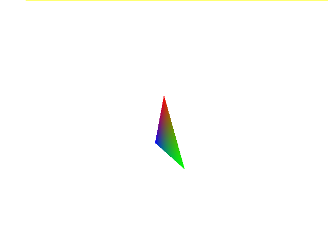

# Vulx: Vulkan-based graphics library
[](https://github.com/Ichinose0/Vulx/actions/workflows/rust.yml)  
Vulx is a Vulkan-based graphics library that is cross-platform and highly flexible.  
  
Vulx abstracts away the tedious parts of Vulkan, allowing you to concentrate more on image processing.  
It also implements other useful functions such as shader compilation and matrix conversion.   
    
You can also output to a png file, draw in a window, etc.

## Supported platforms
 - PNG exporting: Windows, Macos, Linux
 - Window drawing: Windows

## Example
### Rectangle


# Getting started
```
git clone https://github.com/Ichinose0/Vulx
cd Vulx
cargo run --example png
```

# Goals
Fast compilation time. Right now it is ~5s from "cargo clean" for both desktop and web.

Cross platform. Amount of platform specific user code required should be kept as little as possible.

# License
Vulx is licenced under MIT LICENSE.
